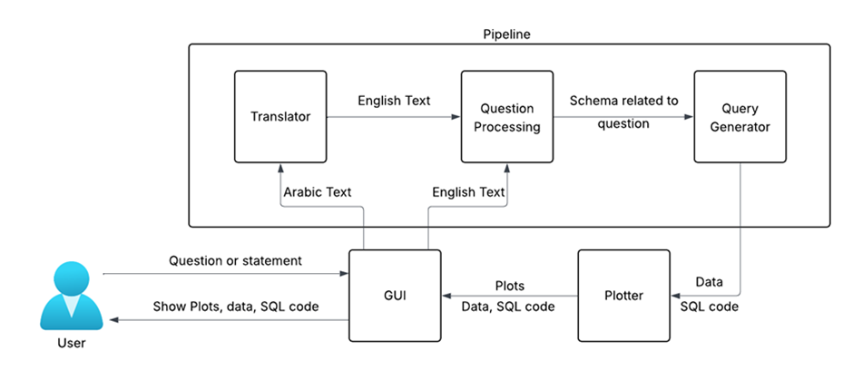

# Arabic Text-to-SQL

A project for converting natural language queries in **Arabic or English** into executable **SQL queries**, as well as generating **data visualizations**, using machine learning and NLP techniques.

---

## 📌 Table of Contents

- [Overview](#overview)
- [Dataset](#dataset)
- [Architecture](#architecture)
- [Installation and Running Steps](#installation-and-running-steps)
- [Examples](#examples)

---

## 📖 Overview

This project explores **neural machine translation**, **semantic parsing**, and interaction with **large language models (LLMs)** to transform Arabic natural language questions into SQL queries.

It targets applications like:
- Business intelligence tools  
- Arabic database interfaces  
- Cross-lingual data access

---

## 📊 Dataset

We used different **English-to-SQL datasets**, which were **back-translated into Arabic** to create the Arabic component of the translator.

**Sources:**
- [WIKISQL](https://github.com/salesforce/WikiSQL)  
- [SPIDER](https://yale-lily.github.io/spider)  
- [BIRD](https://bird-bench.github.io/)

---

## 🧠 Architecture



**Workflow:**
1. User enters a question (Arabic or English) via a GUI.
2. If the input is Arabic, it is first translated to English.
3. The English query is processed to extract schema-relevant entities.
4. The SQL generation module creates the final SQL query.

---

## ⚙️ Installation and Running Steps

### 🔑 Prerequisites
- Create **LangChain** and **Groq** API keys.
- Place them in a `.env` file like this:
```
LANGCHAIN_API_KEY=your_key_here
GROQ_API_KEY=your_key_here
```

### 🧪 Setup

```bash
git clone https://github.com/IbraheimTarek/SimpleQl.git
cd SimpleQl
cp ../.env ./
pip install -r requirements.txt
./src/setup_models.sh
```
### to run the app
```bash
python ./src/app.py
```